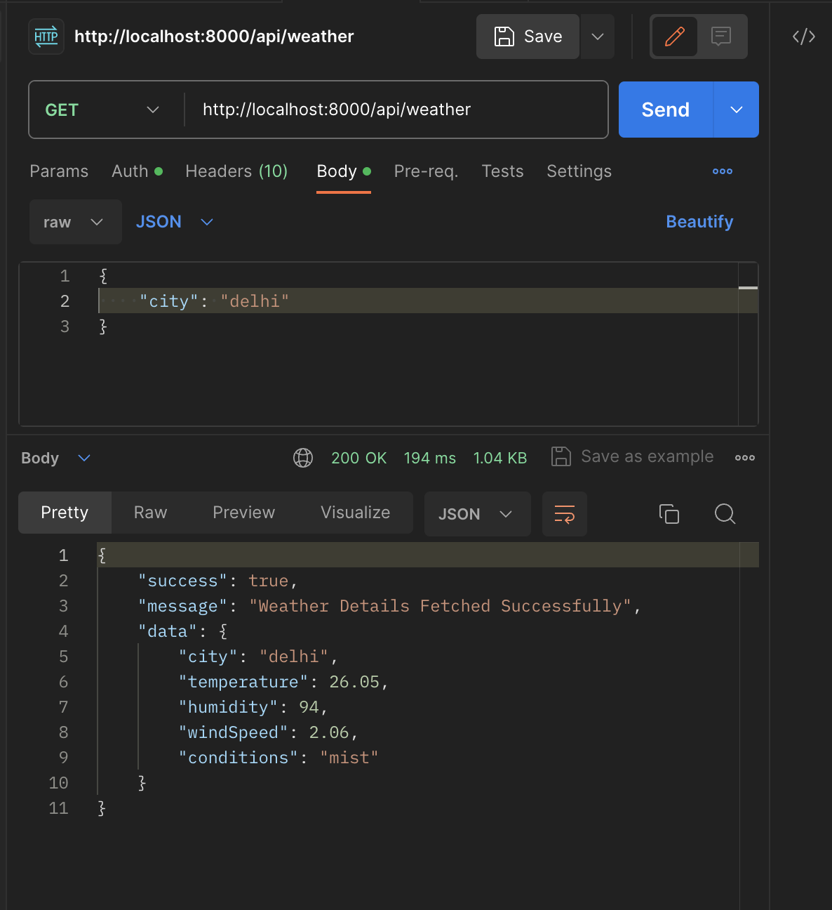

# nimbus 🌦️

A basic weather app that provides real-time weather information to users.
> Made for MLSA club submission for TECHNICAL - BACKEND domain



## Tech Stack
- Node.js
- Express
- Typescript
- openweathermap API
- 
## Setup

Clone the repository:

```bash
git clone https://github.com/na-ch7/nimbus.git
cd nimbus
cd server
```
### Running the app

Install all dependencies

```bash
pnpm i
```

Run the dev server (starts at `localhost:8080`)

```bash
pnpm dev
```

## API Endpoints

`GET /test`
Tester Route

`GET /weather`
Receives the city name in request body and returns weather details in the response:

```json
"data": {
        "city": "chennai",
        "temperature": 29.42,
        "humidity": 83,
        "windSpeed": 3.6,
        "conditions": "scattered clouds"
    }
```

## License

This project is licensed under the MIT License.
